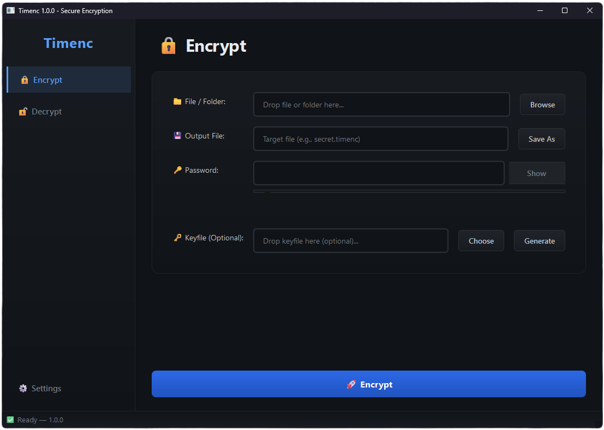

# TimENC 🔐



**TimENC** is a modern, cross-platform encryption tool built with Python and Tkinter.
It uses **ChaCha20-Poly1305 AEAD** encryption and **Argon2id** key derivation for strong, authenticated encryption - designed to be secure, simple, and open-source.

---

## ✨ Features

* **Strong encryption** with ChaCha20-Poly1305 (authenticated AEAD)
* **Secure password-based key derivation** using Argon2id
* **Keyfile support** for additional entropy
* **Automatic directory archiving and encryption**
* **Tamper-resistant headers** (AAD authentication)
* **Protection against tar path traversal**
* **Atomic file writes and secure permissions (600)**
* **Optional secure deletion of source files**
* **Simple, user-friendly GUI (Pyside6)**
* **Cross-platform**: Windows, macOS, Linux

---

## 🔒 Cryptography Details

| Component          | Algorithm                           | Notes                                                    |
| ------------------ | ----------------------------------- | -------------------------------------------------------- |
| **Cipher**         | ChaCha20-Poly1305                   | 256-bit key, 96-bit nonce                                |
| **KDF**            | Argon2id                            | Time-hard and memory-hard, resistant to GPU/ASIC attacks |
| **Authentication** | AAD (Additional Authenticated Data) | Protects all header metadata                             |
| **Keyfile**        | Random 256-bit                      | Optional additional entropy                              |
| **Hashing**        | SHA-256 (for keyfile combination)   | Before key derivation                                    |

### Default Argon2 Parameters

| Parameter   | Value               |
| ----------- | ------------------- |
| Time cost   | 6                   |
| Memory cost | 131072 KiB (128 MB) |
| Parallelism | 2                   |

These parameters can be adjusted to increase or decrease computational cost based on your system performance.

---

## 🧠 How It Works

1. You select a **file or directory**.
2. TimENC creates a **temporary TAR archive** (for directories).
3. It derives a **key** from your password (and optional keyfile) using Argon2id.
4. The data is encrypted with **ChaCha20-Poly1305**, and all metadata is authenticated.
5. The output `.timenc` file contains everything necessary to decrypt.
6. During decryption, all parameters and metadata are verified before decryption.

---

## 🚀 How to Use (Platforms without a Native App)

1. Download the **source code**
2. Install **Python 3.10+**
3. Install dependencies:

   ```bash
   pip install PySide6 cryptography argon2-cffi
   ```
4. Run the Python file

---

## 📜 License

**TimENC is licensed under the GNU General Public License v3.0 (GPL‑3.0).**

### What this means (short & simple)

* ✅ You are free to use TimENC for any purpose
* ✅ You are free to study and modify the source code
* ✅ You are free to share TimENC with others
* ✅ You are free to publish modified versions

**Conditions:**

* Any redistributed or modified version must also be licensed under GPL‑3.0
* The *ource code must remain available
* Changes must be clearly documented

This ensures TimENC stays free, open, and transparent forever, and that improvements benefit everyone.

---

## 📦 Latest Release

👉 **Download the latest release:**
[https://github.com/SnowTimSwiss/TimENC/releases/latest](https://github.com/SnowTimSwiss/TimENC/releases/latest)
