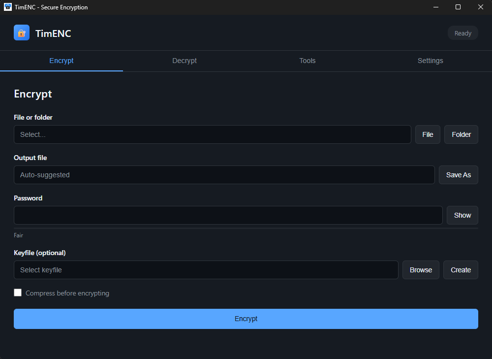

# TimENC 🔐

**TimENC** is a modern, cross-platform encryption tool built with Rust and Tauri.
It uses **ChaCha20-Poly1305 AEAD** encryption and **Argon2id** key derivation for strong, authenticated encryption - designed to be secure, simple, and open-source.



---

## ✨ Features

* **Strong encryption** with ChaCha20-Poly1305 (authenticated AEAD)
* **Secure password-based key derivation** using Argon2id
* **Keyfile support** as an optional second factor
* **Optional zstd compression** before encryption (smaller `.timenc` files for compressible content)
* **Automatic directory archiving and encryption**
* **Encrypted metadata** for filenames and directory flags
* **Tamper-resistant headers** (AAD authentication)
* **Protection against tar path traversal**
* **Secure memory handling** (zeroize on drop)
* **Best-effort overwrite before deleting source files**
* **Cross-platform desktop GUI (Tauri)**
* **Cross-platform**: Windows, macOS, Linux

---

## 🔒 Cryptography Details

| Component          | Algorithm                           | Notes                                                    |
| ------------------ | ----------------------------------- | -------------------------------------------------------- |
| **Cipher**         | ChaCha20-Poly1305                   | 256-bit key, 96-bit nonce                                |
| **KDF**            | Argon2id                            | Time-hard and memory-hard, resistant to GPU/ASIC attacks |
| **Authentication** | Poly1305 MAC                        | Per-chunk authentication                                 |
| **Keyfile**        | Random 256-bit                      | Optional additional entropy                              |
| **Key Combo**      | password + optional keyfile         | Explicitly separated inputs before Argon2 derivation     |

### Default Argon2 Parameters

| Parameter   | Value               |
| ----------- | ------------------- |
| Time cost   | 4                   |
| Memory cost | 131072 KiB (128 MB) |
| Parallelism | 4                   |

---

## 🧠 How It Works

1. You select a **file or directory**.
2. TimENC creates a **temporary TAR archive** for directories.
3. It derives a **key** from your password and optional keyfile using Argon2id.
4. Metadata is encrypted separately from the payload.
5. The data is encrypted with **ChaCha20-Poly1305** in streaming mode (64 KiB chunks).
6. The output `.timenc` file contains the encrypted metadata and payload.
7. During decryption, metadata and payload are authenticated before use.

### File Format

```
TIMENC v4.5 (current):
├─ Magic: "TIMENC" (6 bytes)
├─ Version: 0x05 (1 byte)
├─ Salt: 16 bytes
├─ TimeCost: u32 big-endian (4 bytes)
├─ MemoryKiB: u32 big-endian (4 bytes)
├─ Parallelism: u32 big-endian (4 bytes)
├─ MetadataNonce: 12 bytes
├─ DataNonce: 12 bytes
└─ MetadataLen: u32 big-endian (4 bytes)

Encrypted Metadata:
├─ is_dir: 1 byte
├─ name_len: u16 big-endian
├─ original_name: UTF-8
└─ compressed: 1 byte (whether the payload was zstd-compressed before encryption)

Encrypted Payload:
├─ Metadata ciphertext + tag
└─ Data chunks: ciphertext + tag (64 KiB plaintext per chunk)

Supported files (decryption only):
├─ v3 (Version 0x03, no encrypted metadata)
└─ v4 (Version 0x04, same layout as v4.5 but without the `compressed` byte)

v4.5 uses the same cryptography as v4 (ChaCha20-Poly1305 + Argon2id) - the
version bump only exists so that builds without compression support fail
with a clear "unsupported version" error instead of silently emitting
still-compressed data when decrypting a compressed file.
```

---

## 🚀 Installation

### From Releases

Download the latest release for your platform:
- **Windows**: `.exe` installer or portable executable
- **macOS**: `.dmg` disk image
- **Linux**: `.AppImage`, `.deb`, or `.flatpak` bundle

👉 **Download:** [https://github.com/SnowTimSwiss/TimENC/releases/latest](https://github.com/SnowTimSwiss/TimENC/releases/latest)


## 💻 Command Line Interface (CLI)

TimENC supports both GUI and CLI modes. Use the CLI for scripting, automation, or headless environments.

```

### CLI Commands Overview

| Command | Description |
|---------|-------------|
| `encrypt <input> -o <output> -p <password> [-k <keyfile>]` | Encrypt a file or folder |
| `decrypt <input> -o <output> -p <password> [-k <keyfile>]` | Decrypt a .timenc file |
| `generate-keyfile <output>` | Generate a new random keyfile (32 bytes) |

### CLI Options

| Option | Description |
|--------|-------------|
| `-o, --output` | Output path (file for encrypt, folder for decrypt) |
| `-p, --password` | Password for encryption/decryption |
| `-k, --keyfile` | Optional keyfile for additional entropy |
| `--compress` | Compress with zstd before encrypting (encrypt only) |
| `--delete-source` | Delete source file after operation |
| `-h, --help` | Show help message |
| `-v, --version` | Show version information |

---

## 🖥️ GUI Features

* **Modern dark theme** inspired by GitHub Dark
* **Drag & drop** support for files
* **Password strength indicator**
* **Keyfile generator** built-in
* **Progress feedback** with detailed status messages
* **Native file dialogs** for secure file selection

---

## 🛠️ Building from Source

You need a [Rust toolchain](https://rustup.rs/) and the
[Tauri CLI](https://tauri.app/) (`cargo install tauri-cli --locked`).
On Linux, install the Tauri system dependencies (WebKitGTK, GTK, etc.) for your
distribution first.

```bash
# Clone
git clone https://github.com/SnowTimSwiss/TimENC.git
cd TimENC

# Run the GUI in development
cd src-tauri && cargo tauri dev

# Build release bundles for your platform
cargo tauri build
```

### Testing

The core crypto and file-format logic is covered by integration tests:

```bash
cargo test
```

---

## 📜 License

**TimENC is licensed under the GNU General Public License v3.0 (GPL‑3.0).**

### What this means:

* ✅ You are free to use TimENC for any purpose
* ✅ You are free to study and modify the source code
* ✅ You are free to share TimENC with others
* ✅ You are free to publish modified versions

**Conditions:**

* Any redistributed or modified version must also be licensed under GPL‑3.0 or compatible
* The source code must remain available
* Changes must be clearly documented

This ensures TimENC stays free, open, and transparent forever, and that improvements benefit everyone.

---

## 📦 Latest Release

👉 **Download the latest release:**
[https://github.com/SnowTimSwiss/TimENC/releases/latest](https://github.com/SnowTimSwiss/TimENC/releases/latest)

---

**TimENC** – Built with ❤️