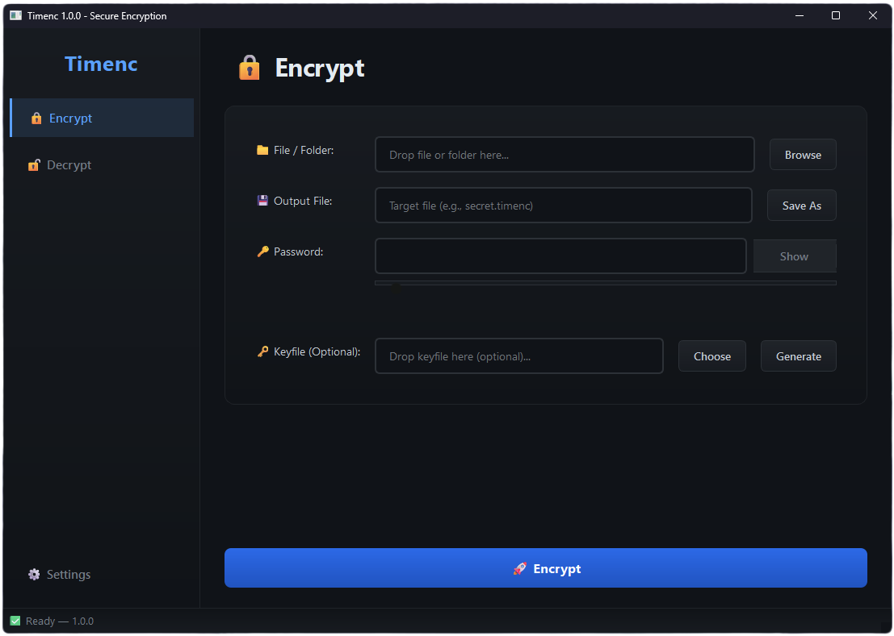

# TimENC 🔐



**TimENC** is a modern, cross-platform encryption tool built with Rust and Tauri.
It uses **ChaCha20-Poly1305 AEAD** encryption and **Argon2id** key derivation for strong, authenticated encryption - designed to be secure, simple, and open-source.

> **Version 2.1.1** - Complete rewrite in Rust for better performance, memory safety, and smaller binaries.
> Encryption default is v4. Decryption stays compatible with v3 and v4 files.

---

## ✨ Features

* **Strong encryption** with ChaCha20-Poly1305 (authenticated AEAD)
* **Secure password-based key derivation** using Argon2id
* **Keyfile support** as an optional second factor
* **Automatic directory archiving and encryption**
* **Encrypted metadata** for filenames and directory flags
* **Tamper-resistant headers** (AAD authentication)
* **Protection against tar path traversal**
* **Secure memory handling** (zeroize on drop)
* **Optional best-effort overwrite before deleting source files**
* **Cross-platform desktop GUI (Tauri)**
* **Cross-platform**: Windows, macOS, Linux
* **Small binaries** (~10MB vs ~100MB Python version)

---

## 🔒 Cryptography Details

| Component          | Algorithm                           | Notes                                                    |
| ------------------ | ----------------------------------- | -------------------------------------------------------- |
| **Cipher**         | ChaCha20-Poly1305                   | 256-bit key, 96-bit nonce                                |
| **KDF**            | Argon2id                            | Time-hard and memory-hard, resistant to GPU/ASIC attacks |
| **Authentication** | Poly1305 MAC                        | Per-chunk authentication                                 |
| **Keyfile**        | Random 256-bit                      | Optional additional entropy                              |
| **Key Combo**      | password + optional keyfile         | Explicitly separated inputs before Argon2 derivation     |

### Default Argon2 Parameters

| Parameter   | Value               |
| ----------- | ------------------- |
| Time cost   | 4                   |
| Memory cost | 131072 KiB (128 MB) |
| Parallelism | 4                   |

---

## 🧠 How It Works

1. You select a **file or directory**.
2. TimENC creates a **temporary TAR archive** for directories.
3. It derives a **key** from your password and optional keyfile using Argon2id.
4. Metadata is encrypted separately from the payload.
5. The data is encrypted with **ChaCha20-Poly1305** in streaming mode (64 KiB chunks).
6. The output `.timenc` file contains the encrypted metadata and payload.
7. During decryption, metadata and payload are authenticated before use.

### File Format

```
TIMENC v4:
├─ Magic: "TIMENC" (6 bytes)
├─ Version: 0x04 (1 byte)
├─ Salt: 16 bytes
├─ TimeCost: u32 big-endian (4 bytes)
├─ MemoryKiB: u32 big-endian (4 bytes)
├─ Parallelism: u32 big-endian (4 bytes)
├─ MetadataNonce: 12 bytes
├─ DataNonce: 12 bytes
└─ MetadataLen: u32 big-endian (4 bytes)

Encrypted Metadata:
├─ is_dir: 1 byte
├─ name_len: u16 big-endian
└─ original_name: UTF-8

Encrypted Payload:
├─ Metadata ciphertext + tag
└─ Data chunks: ciphertext + tag (64 KiB plaintext per chunk)

Supported files:
├─ v3 remains decryptable
└─ v4 is the default encryption format
```

---

## 🚀 Installation

### From Releases

Download the latest release for your platform:
- **Windows**: `.exe` installer or portable executable
- **macOS**: `.dmg` disk image
- **Linux**: `.AppImage`, `.deb`, or binary

👉 **Download:** [https://github.com/SnowTimSwiss/TimENC/releases/latest](https://github.com/SnowTimSwiss/TimENC/releases/latest)

### From Source

```bash
# Clone the repository
git clone https://github.com/SnowTimSwiss/TimENC.git
cd TimENC

# Build CLI
cargo build --release

# Build GUI (requires Tauri dependencies)
cargo install tauri-cli
cargo tauri build
```

---

## 💻 Command Line Interface (CLI)

TimENC supports both GUI and CLI modes. Use the CLI for scripting, automation, or headless environments.

### Basic Usage

```bash
# Show help
timenc --help

# Show version
timenc --version
```

### Encrypt a File

```bash
timenc encrypt <input_file> -o <output.timenc> -p <password>
```

**Example:**
```bash
timenc encrypt secret.txt -o secret.timenc -p "MySecurePassword123"
```

### Encrypt a Folder

```bash
timenc encrypt <folder_path> -o <output.timenc> -p <password>
```

**Example:**
```bash
timenc encrypt ./my_documents -o backup.timenc -p "MySecurePassword123"
```

### Decrypt a File

```bash
timenc decrypt <input.timenc> -o <output_folder> -p <password>
```

**Example:**
```bash
timenc decrypt secret.timenc -o ./decrypted -p "MySecurePassword123"
```

### Using a Keyfile (Optional)

For additional security, combine a password with a keyfile:

```bash
# Generate a new keyfile
timenc generate-keyfile ./mykeyfile.key

# Encrypt with password + keyfile
timenc encrypt secret.txt -o secret.timenc -p "MyPassword" -k ./mykeyfile.key

# Decrypt with password + keyfile
timenc decrypt secret.timenc -o ./decrypted -p "MyPassword" -k ./mykeyfile.key
```

### CLI Commands Overview

| Command | Description |
|---------|-------------|
| `encrypt <input> -o <output> -p <password> [-k <keyfile>]` | Encrypt a file or folder |
| `decrypt <input> -o <output> -p <password> [-k <keyfile>]` | Decrypt a .timenc file |
| `generate-keyfile <output>` | Generate a new random keyfile (32 bytes) |

### CLI Options

| Option | Description |
|--------|-------------|
| `-o, --output` | Output path (file for encrypt, folder for decrypt) |
| `-p, --password` | Password for encryption/decryption |
| `-k, --keyfile` | Optional keyfile for additional entropy |
| `--delete-source` | Delete source file after operation |
| `-h, --help` | Show help message |
| `-v, --version` | Show version information |

---

## 🖥️ GUI Features

* **Modern dark theme** inspired by GitHub Dark
* **Drag & drop** support for files
* **Password strength indicator**
* **Keyfile generator** built-in
* **Progress feedback** with detailed status messages
* **Native file dialogs** for secure file selection

---

## 🔀 Compatibility

| Feature | Python TimENC (v1.x) | Rust TimENC (v2.x) |
|---------|---------------------|-------------------|
| **V2 Decryption** | ✅ | ❌ |
| **V3 Decryption** | ✅ | ✅ |
| **V4 Decryption** | ❌ | ✅ |
| **V2 Encryption** | ✅ | ❌ (deprecated) |
| **V3 Encryption** | ✅ | ❌ (legacy) |
| **V4 Encryption** | ❌ | ✅ (default) |
| **Keyfile Format** | 32 Bytes | 32 Bytes (compatible) |
| **Argon2 Parameters** | time=4, mem=128MB, parallel=4 | v4 defaults, versioned in header |

---

## 📜 License

**TimENC is licensed under the GNU General Public License v3.0 (GPL‑3.0).**

### What this means (short & simple)

* ✅ You are free to use TimENC for any purpose
* ✅ You are free to study and modify the source code
* ✅ You are free to share TimENC with others
* ✅ You are free to publish modified versions

**Conditions:**

* Any redistributed or modified version must also be licensed under GPL‑3.0
* The source code must remain available
* Changes must be clearly documented

This ensures TimENC stays free, open, and transparent forever, and that improvements benefit everyone.

---

## 📦 Latest Release

👉 **Download the latest release:**
[https://github.com/SnowTimSwiss/TimENC/releases/latest](https://github.com/SnowTimSwiss/TimENC/releases/latest)
