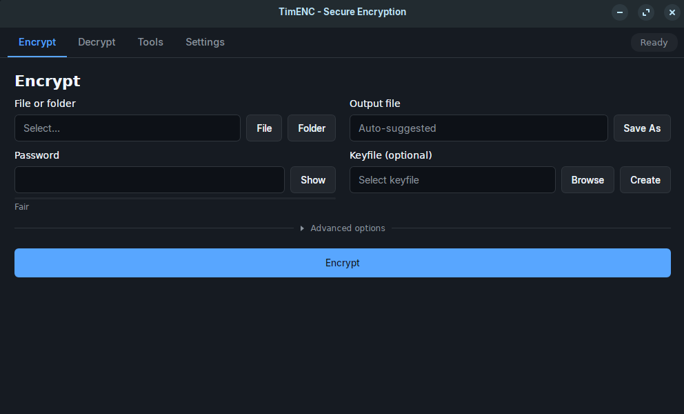

# TimENC 🔐

**TimENC** is a modern, cross-platform encryption tool built with Rust and Tauri.
It uses **ChaCha20-Poly1305 AEAD** encryption and **Argon2id** key derivation for strong, authenticated encryption - designed to be secure, simple, and open-source.



---

## ✨ Features

* **Strong encryption** with ChaCha20-Poly1305 (authenticated AEAD)
* **Secure password-based key derivation** using Argon2id
* **Keyfile support** as an optional second factor
* **Optional zstd compression** before encryption (smaller `.timenc` files for compressible content)
* **Automatic directory archiving and encryption**
* **Encrypted metadata** for filenames and directory flags
* **Key-committing headers** - a file decrypts under exactly one password, and a wrong one is rejected before any ciphertext is touched
* **Tamper-evident streams** - truncating, reordering, duplicating, or appending chunks is detected
* **Tamper-resistant headers** (AAD authentication)
* **Optional size padding** to hide the exact plaintext size
* **Selectable KDF strength** (`balanced` / `paranoid`)
* **Protection against tar path traversal**
* **Secure memory handling** (zeroize on drop)
* **Best-effort overwrite before deleting source files**
* **Cross-platform desktop GUI (Tauri)**
* **Cross-platform**: Windows, macOS, Linux

---

## 🔒 Cryptography Details

| Component          | Algorithm                           | Notes                                                    |
| ------------------ | ----------------------------------- | -------------------------------------------------------- |
| **Cipher**         | ChaCha20-Poly1305                   | 256-bit key, 96-bit nonce                                |
| **KDF**            | Argon2id                            | Time-hard and memory-hard, resistant to GPU/ASIC attacks |
| **Subkey schedule**| Keyed BLAKE2b                       | Separate metadata, data, and commitment keys per file    |
| **Authentication** | Poly1305 MAC                        | Per-chunk, over chunk index and end-of-stream marker     |
| **Key commitment** | 32-byte BLAKE2b tag                 | Binds the file to one key; rejects a wrong one before any ciphertext work |
| **Keyfile**        | Random 256-bit                      | Optional additional entropy                              |
| **Key Combo**      | password + optional keyfile         | Explicitly separated inputs before Argon2 derivation     |
| **Padding**        | Padmé (optional)                    | Hides the exact plaintext size, <=12% overhead           |

### Argon2 Profiles

The profile is chosen at encryption time and recorded in the header, so files
encrypted with different settings all stay readable.

| Profile              | Time cost | Memory cost           | Parallelism |
| -------------------- | --------- | --------------------- | ----------- |
| `balanced` (default) | 3         | 262144 KiB (256 MB)   | 4           |
| `paranoid`           | 4         | 1048576 KiB (1 GB)    | 4           |

Parameters read from a file header are bounds-checked (8 MiB - 4 GiB memory,
1 - 64 passes) so that a crafted file cannot force an out-of-memory abort.

### Quantum resistance

TimENC is **already post-quantum secure**, and not by accident: it contains no
public-key cryptography at all. There is no RSA, no Diffie-Hellman, and no
signature scheme - and those are precisely what Shor's algorithm breaks.

* **ChaCha20-Poly1305 (256-bit key)** - Grover's algorithm reduces this to an
  effective 128 bits of security. 2^128 quantum operations are out of reach for
  any conceivable hardware, and Grover parallelises very poorly.
* **Argon2id** - memory-hard. A quantum computer has nothing that helps against
  needing hundreds of megabytes of memory per guess, so Grover buys an attacker
  almost nothing against the KDF.
* **Poly1305 and BLAKE2b** - symmetric, and likewise unaffected.

Post-quantum key exchange (ML-KEM and friends) only becomes relevant if TimENC
ever gains public-key features, such as encrypting a file for someone else's
public key. If that lands, it will be a **hybrid** construction (X25519 +
ML-KEM), never post-quantum alone.

---

## 🧠 How It Works

1. You select a **file or directory**.
2. TimENC creates a **temporary TAR archive** for directories, and compresses the
   payload with zstd if you asked for it.
3. It derives a **master key** from your password and optional keyfile using
   Argon2id, then splits it into separate **metadata, data, and commitment
   subkeys** with keyed BLAKE2b.
4. The commitment tag goes into the header, binding the file to that one key.
5. Metadata (filename, directory flag, compression flag, true payload length) is
   encrypted under the metadata key.
6. The payload is encrypted with **ChaCha20-Poly1305** in 64 KiB chunks under the
   data key. Each chunk authenticates the full header, its own index, and whether
   it is the last chunk. Optional padding is appended before this step.
7. During decryption the commitment is checked first (so a wrong password fails
   without any ciphertext work), then metadata and every payload chunk are
   authenticated, and the
   stream is rejected unless it ends at the chunk marked final.

### File Format

```
TIMENC v6 (current):
├─ Magic: "TIMENC" (6 bytes)
├─ Version: 0x06 (1 byte)
├─ Salt: 16 bytes
├─ TimeCost: u32 big-endian (4 bytes)
├─ MemoryKiB: u32 big-endian (4 bytes)
├─ Parallelism: u32 big-endian (4 bytes)
├─ MetadataLen: u32 big-endian (4 bytes)
└─ KeyCommitment: 32 bytes
   (71 bytes total, fixed size - no nonces, see below)

Encrypted Metadata:
├─ is_dir: 1 byte
├─ name_len: u16 big-endian
├─ original_name: UTF-8
├─ compressed: 1 byte (payload was zstd-compressed before encryption)
└─ payload_len: u64 big-endian (true length, before padding)

Encrypted Payload:
├─ Metadata ciphertext + tag
└─ Data chunks: ciphertext + tag (64 KiB plaintext per chunk),
   terminated by a chunk marked final (possibly empty)

Supported files (decryption only):
├─ v3   (Version 0x03, no encrypted metadata)
├─ v4   (Version 0x04, encrypted metadata, no `compressed` byte)
└─ v4.5 (Version 0x05, v4 plus the `compressed` byte)
```

### What v6 changed, and why

Version byte `0x05` was already spent on "v4.5", a metadata-only tweak, so the
first real cryptographic change since v4 takes byte `0x06` - and is named v6 to
match, rather than continuing to count format generations separately from
version bytes.

| Change | Why |
| ------ | --- |
| **Terminated chunk stream.** Every chunk authenticates its own index and an `is_final` marker. | v4 decrypted until end-of-file. Cutting a v4 file at a 64 KiB chunk boundary left every remaining tag valid, so it reported success and returned a silently shortened file. v6 rejects that. Reordered, duplicated, and appended chunks are caught by the same mechanism. |
| **Key commitment** in the header. | ChaCha20-Poly1305 is not key-committing on its own, so a file could be crafted to decrypt to different valid plaintexts under two different passwords. It also means a wrong password is rejected right after key derivation, without any trial decryption (the Argon2id run itself is of course still paid). |
| **Subkey hierarchy.** Metadata, payload, and commitment keys are separate keyed-BLAKE2b subkeys of the Argon2id output. | v4 used one key for everything, separated only by AAD labels. Because each subkey is unique per file, chunk nonces became plain counters starting at zero - no random nonce base and no modular wraparound. It also means Argon2id runs **once** per file instead of twice. |
| **Header Argon2 parameters are honoured.** | v4 stored them but derived with hardcoded constants, so the fields were decorative and the cost could never be raised without breaking old files. Now bounds-checked and used, which is what makes the `paranoid` profile possible. |
| **Optional Padmé padding.** | The ciphertext size otherwise reveals the plaintext size almost exactly. |
| **No panics on hostile input.** | Key derivation and header parsing return errors instead of panicking; the release profile aborts on panic. |

---

## 🚀 Installation

### From Releases

Download the latest release for your platform:
- **Windows**: `.exe` installer or portable executable
- **macOS**: `.dmg` disk image
- **Linux**: `.AppImage`, `.deb`, or `.flatpak` bundle

👉 **Download:** [https://github.com/SnowTimSwiss/TimENC/releases/latest](https://github.com/SnowTimSwiss/TimENC/releases/latest)


## 💻 Command Line Interface (CLI)

TimENC supports both GUI and CLI modes. Use the CLI for scripting, automation, or headless environments.

```

### CLI Commands Overview

| Command | Description |
|---------|-------------|
| `encrypt <input> -o <output> -p <password> [-k <keyfile>]` | Encrypt a file or folder |
| `decrypt <input> -o <output> -p <password> [-k <keyfile>]` | Decrypt a .timenc file |
| `generate-keyfile <output>` | Generate a new random keyfile (32 bytes) |

### CLI Options

| Option | Description |
|--------|-------------|
| `-o, --output` | Output path (file for encrypt, folder for decrypt) |
| `-p, --password` | Password for encryption/decryption |
| `-k, --keyfile` | Optional keyfile for additional entropy |
| `--compress` | Compress with zstd before encrypting (encrypt only) |
| `--pad` | Pad the payload to hide the exact plaintext size (encrypt only, <=12% overhead) |
| `--kdf-profile` | Argon2id cost profile: `balanced` (default) or `paranoid` (encrypt only) |
| `--delete-source` | Delete source file after operation |
| `-h, --help` | Show help message |
| `-v, --version` | Show version information |

---

## 🖥️ GUI Features

* **Modern dark theme** inspired by GitHub Dark
* **Drag & drop** support for files
* **Password strength indicator**
* **Keyfile generator** built-in
* **Progress feedback** with detailed status messages
* **Native file dialogs** for secure file selection

---

## 🛠️ Building from Source

You need a [Rust toolchain](https://rustup.rs/) and the
[Tauri CLI](https://tauri.app/) (`cargo install tauri-cli --locked`).
On Linux, install the Tauri system dependencies (WebKitGTK, GTK, etc.) for your
distribution first.

```bash
# Clone
git clone https://github.com/SnowTimSwiss/TimENC.git
cd TimENC

# Run the GUI in development
cd src-tauri && cargo tauri dev

# Build release bundles for your platform
cargo tauri build
```

### Testing

The core crypto and file-format logic is covered by integration tests:

```bash
cargo test
```

---

## 📜 License

**TimENC is licensed under the GNU General Public License v3.0 (GPL‑3.0).**

### What this means:

* ✅ You are free to use TimENC for any purpose
* ✅ You are free to study and modify the source code
* ✅ You are free to share TimENC with others
* ✅ You are free to publish modified versions

**Conditions:**

* Any redistributed or modified version must also be licensed under GPL‑3.0 or compatible
* The source code must remain available
* Changes must be clearly documented

This ensures TimENC stays free, open, and transparent forever, and that improvements benefit everyone.

---

## 📦 Latest Release

👉 **Download the latest release:**
[https://github.com/SnowTimSwiss/TimENC/releases/latest](https://github.com/SnowTimSwiss/TimENC/releases/latest)

---

**TimENC** – Built with ❤️